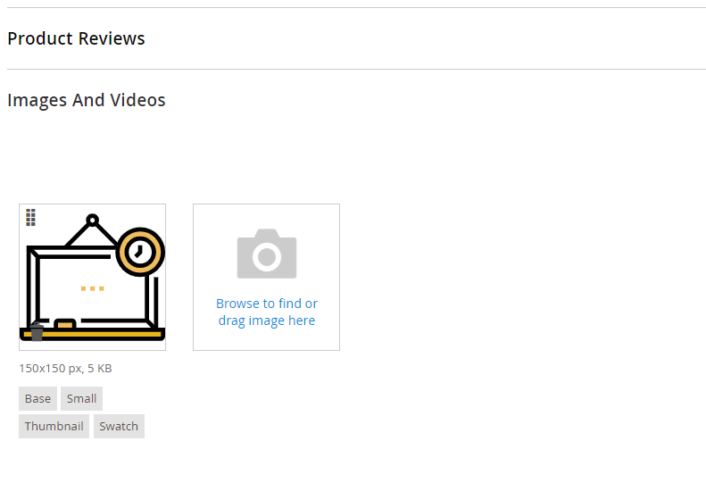
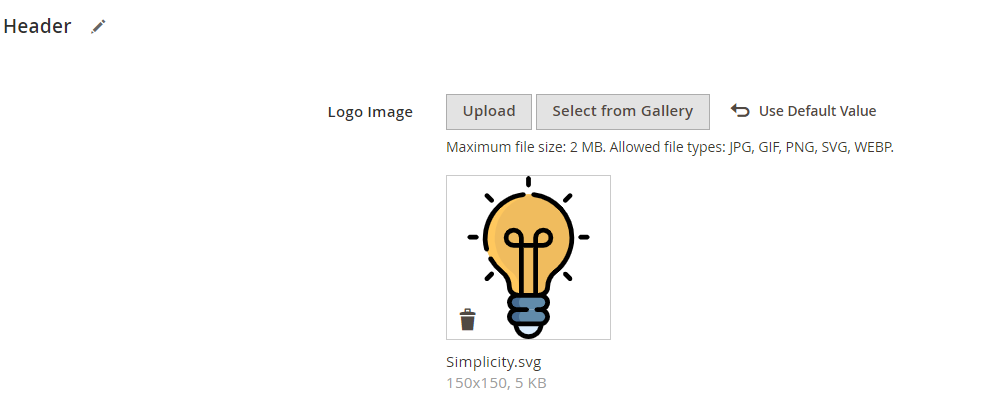

# Magento 2 Image Upload Permission Extension

Enhance your Magento 2 store's functionality by enabling customers to upload SVG and WEBP files seamlessly. This extension integrates directly with PageBuilder and other key areas of your store to streamline content management and improve user engagement.

**[Image Upload extension for Magento 2](https://mavenbird.com/magento-2-image-upload-permission-extension)** 

## Key Features:

- **Supported File Types:** 
    Allows uploads of SVG and WEBP files.
- **Integration:** 
    Seamlessly integrates with PageBuilder, Wysiwyg editor, theme logo, favicon, product media gallery, attribute option swatch images, category image, and custom image uploader fields.
- **User-Friendly:** 
    Simplifies the upload process with an intuitive interface.
- **Security:** 
    Ensures secure uploads with built-in validation checks.

## Usage

- **PageBuilder:**
  Navigate to the PageBuilder editor.
- **Wysiwyg editor:**
  Access the editor and click on the upload button.
- **Theme Settings:**
  Set theme logo and favicon using uploaded files.
- **Product Media Gallery:**
  Manage product images with SVG and WEBP support.
- **Attribute Option Swatches:**
  Enhance attribute options with custom images.
- **Category Images:**
  Upload category images directly.

## Benefits:

- **Enhanced Customer Experience:**
  Provide a more flexible and engaging content management experience by allowing diverse file types.
- **Improved Content Management:**
  Streamline content creation and management with easy file uploads directly in PageBuilder and Wysiwyg editor.
- **Increased Flexibility:**
  Allow for more creative and diverse content by supporting a wider range of file types.
- **Secure and Reliable:**
  Ensure safe and secure file uploads with robust validation mechanisms.

## Compatibility:
This extension is compatible with Magento 2.x versions, ensuring seamless integration with your existing store setup.

## Installation:
**Install via composer (recommended)**

Easy installation process with step-by-step instructions provided for hassle-free setup.
~~~~~~~~~~~~~~~~~~~~~~~~~~~~
composer require mavenbird/imageuploader
php bin/magento setup:upgrade
php bin/magento setup:static-content:deploy
php bin/magento setup:di:compile
php bin/magento cache:flush
~~~~~~~~~~~~~~~~~~~~~~~~~~~~

## Upgrade/Update Module:
Run the following command in Magento 2 root folder for easy update -
~~~~~~~~~~~~~~~~~~~~~
composer update mavenbird/imageuploader
php bin/magento setup:upgrade
php bin/magento setup:static-content:deploy
php bin/magento setup:di:compile
php bin/magento cache:flush
~~~~~~~~~~~~~~~~~~~~~

## Customization Options:
Tailor the file upload settings to match your store's needs with customizable templates and configurations.

**Configure at Your Ease**

## Support:
Dedicated support team available to assist with installation, customization, and any other queries or concerns.
**[support@mavenbird.com](support@mavenbird.com)** 

## Get Started:
Enhance your Magento 2 store with the ability to support diverse file uploads directly in PageBuilder and Wysiwyg editor. Elevate the content management experience and drive customer satisfaction with our Magento 2 File Upload Permission Extension.

**Thank you!**