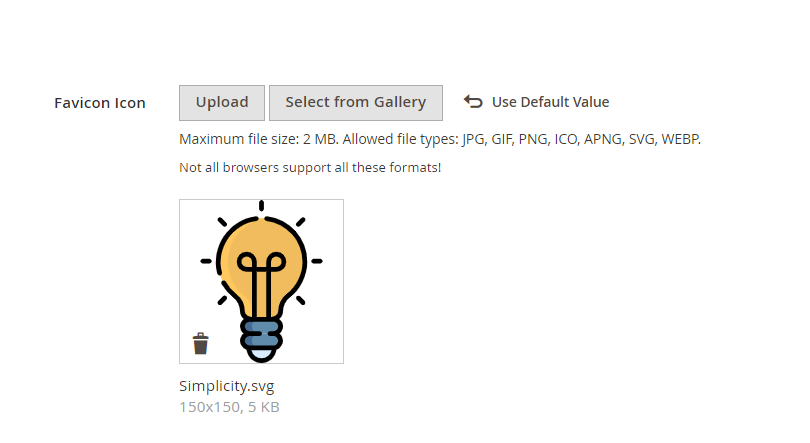
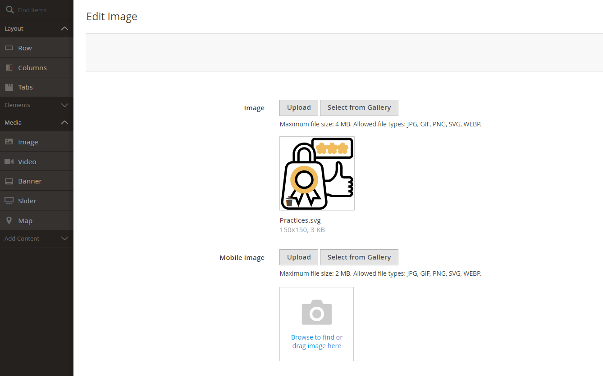

# Magento 2 Admin Category Product Link Module
The mavenbird/module-admin-category-product-link module for Magento 2 facilitates enhanced product management by providing an intuitive interface for linking products to categories directly from the admin panel. This extension streamlines the process of associating products with categories, enhancing store management efficiency.

## Key Features:
- **Product-Category Linking:**
Seamlessly link products to categories from the admin interface.
- **Enhanced User Interface:**
User-friendly interface for managing product-category associations.
- **Bulk Actions:**
Support for bulk linking and unlinking of products to categories.
- **Customizable Views:**
Adjustable grid views to fit specific business needs.
- **Search and Filter:**
Advanced search and filtering options to quickly find and manage product-category links.

## Benefits:
- **Efficiency:**
Streamline product-category management tasks with an intuitive admin interface.
- **Accuracy:**
Reduce manual errors with enhanced user controls and bulk actions.
- **Flexibility:**
Adapt the module to specific business requirements with customizable views and filters.
- **Scalability:**
Manage large product catalogs and numerous categories effortlessly.

## Compatibility:
This extension is compatible with Magento 2.4.X (PHP - 8.1 - 8.3) version.

## Installation:
*Install via composer (recommend)* - 

Easy installation process with step-by-step instructions provided for hassle-free setup.
~~~~~~~~~~~~~~~~~~~~~
php bin/magento module:enable mavenbird/module-admincategoryproductlink
php bin/magento setup:upgrade
php bin/magento setup:static-content:deploy
php bin/magento cache:flush
Manual Installation:
Download the latest release from GitHub releases.
~~~~~~~~~~~~~~~~~~~~~

## Upgrade/Update Module:
Run the following command in Magento 2 root folder for easy update -
~~~~~~~~~~~~~~~~~~~~~
php bin/magento module:enable mavenbird/module-admincategoryproductlink
php bin/magento setup:upgrade
php bin/magento setup:static-content:deploy
php bin/magento cache:flush
~~~~~~~~~~~~~~~~~~~~~

## Customization Options:

## Support:
Dedicated support team available to assist with installation, customization, and any other queries or concerns.
*[support@mavenbird.com](mailto:support@mavenbird.com)* 

## Get Started:
Boost your Magento 2 store's efficiency with the mavenbird/module-admin-category-product-link module. This module simplifies the process of linking products to categories directly from the admin panel, enhancing stock management, improving organizational accuracy, and streamlining operations.

*Thank you!*